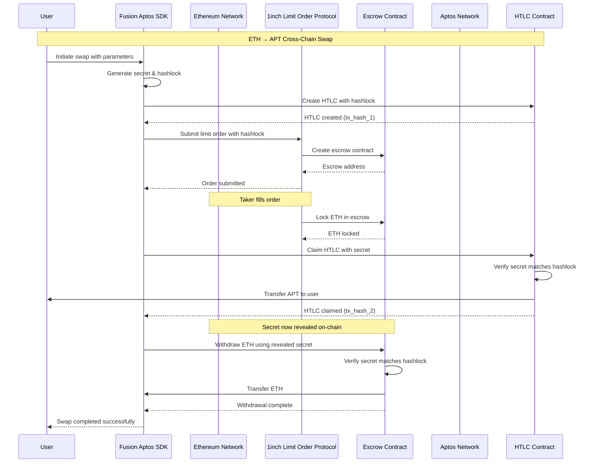
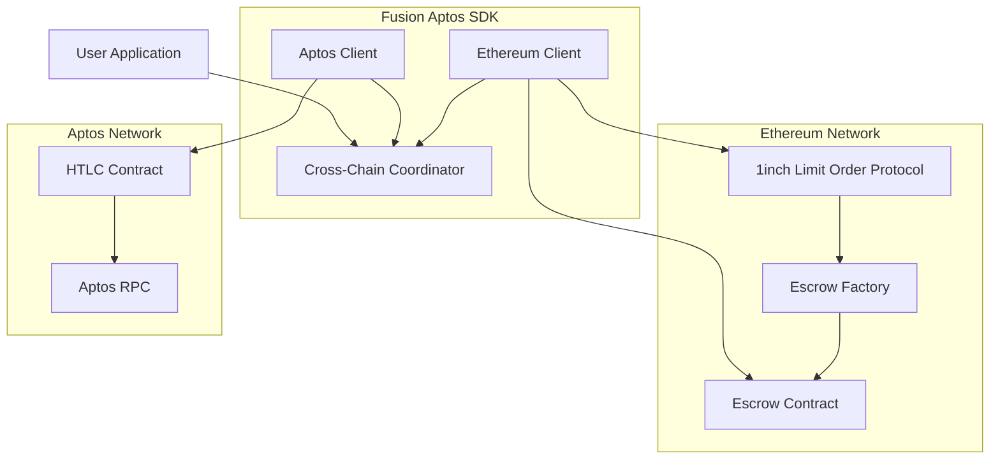
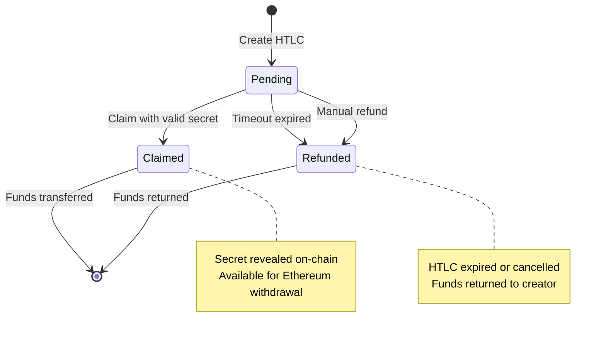

## Fusion Aptos (WIP)

This is a POC implementation of how to swap tokens from an EVM chain to aptos using 1inch limit order protocol 

```mermaid
sequenceDiagram
    participant User
    participant SDK as Fusion Aptos SDK
    participant Ethereum as Ethereum Network
    participant LOP as 1inch Limit Order Protocol
    participant Escrow as Escrow Contract
    participant Aptos as Aptos Network
    participant HTLC as HTLC Contract

    Note over User, HTLC: ETH → APT Cross-Chain Swap

    User->>SDK: Initiate swap with parameters
    SDK->>SDK: Generate secret & hashlock
    
    SDK->>HTLC: Create HTLC with hashlock
    HTLC-->>SDK: HTLC created (tx_hash_1)
    
    SDK->>LOP: Submit limit order with hashlock
    LOP->>Escrow: Create escrow contract
    Escrow-->>LOP: Escrow address
    LOP-->>SDK: Order submitted
    
    Note over Ethereum, LOP: Taker fills order
    
    LOP->>Escrow: Lock ETH in escrow
    Escrow-->>LOP: ETH locked
    
    SDK->>HTLC: Claim HTLC with secret
    HTLC->>HTLC: Verify secret matches hashlock
    HTLC->>User: Transfer APT to user
    HTLC-->>SDK: HTLC claimed (tx_hash_2)
    
    Note over Ethereum, Escrow: Secret now revealed on-chain
    
    SDK->>Escrow: Withdraw ETH using revealed secret
    Escrow->>Escrow: Verify secret matches hashlock
    Escrow->>SDK: Transfer ETH
    Escrow-->>SDK: Withdrawal complete
    
    SDK-->>User: Swap completed successfully
```

## Architecture Overview

```mermaid
graph TB
    subgraph "Ethereum Network"
        LOP[1inch Limit Order Protocol]
        EscrowFactory[Escrow Factory]
        EscrowContract[Escrow Contract]
        
        LOP --> EscrowFactory
        EscrowFactory --> EscrowContract
    end
    
    subgraph "Aptos Network"
        HTLCContract[HTLC Contract]
        AptosRPC[Aptos RPC]
        
        HTLCContract --> AptosRPC
    end
    
    subgraph "Fusion Aptos SDK"
        EthClient[Ethereum Client]
        AptosClient[Aptos Client]
        Coordinator[Cross-Chain Coordinator]
        
        EthClient --> Coordinator
        AptosClient --> Coordinator
    end
    
    EthClient --> LOP
    EthClient --> EscrowContract
    AptosClient --> HTLCContract
    
    User[User Application] --> Coordinator
```

## HTLC State Machine

```mermaid
stateDiagram-v2
    [*] --> Pending: Create HTLC
    
    Pending --> Claimed: Claim with valid secret
    Pending --> Refunded: Timeout expired
    Pending --> Refunded: Manual refund
    
    Claimed --> [*]: Funds transferred
    Refunded --> [*]: Funds returned
    
    note right of Claimed
        Secret revealed on-chain
        Available for Ethereum withdrawal
    end note
    
    note right of Refunded
        HTLC expired or cancelled
        Funds returned to creator
    end note
```