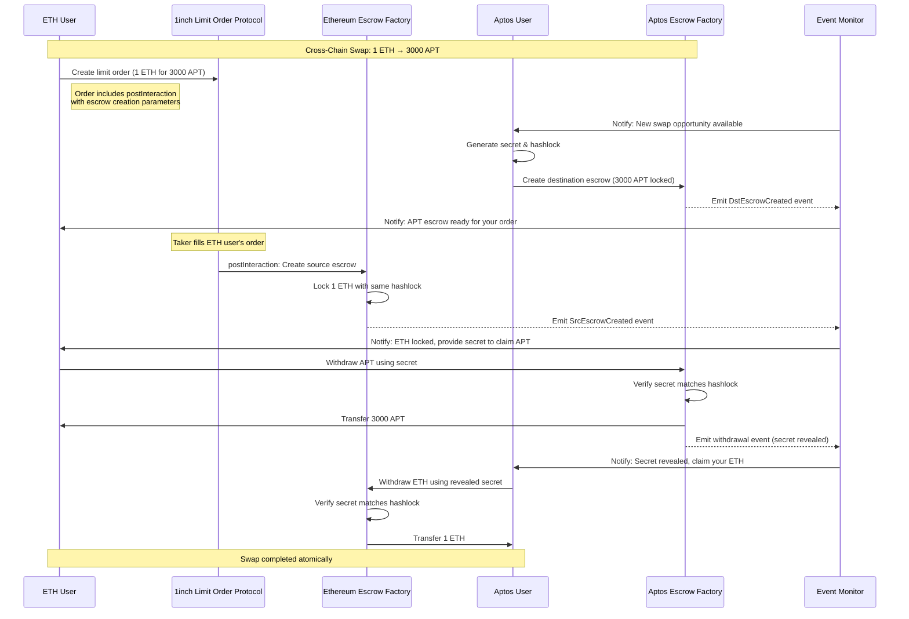
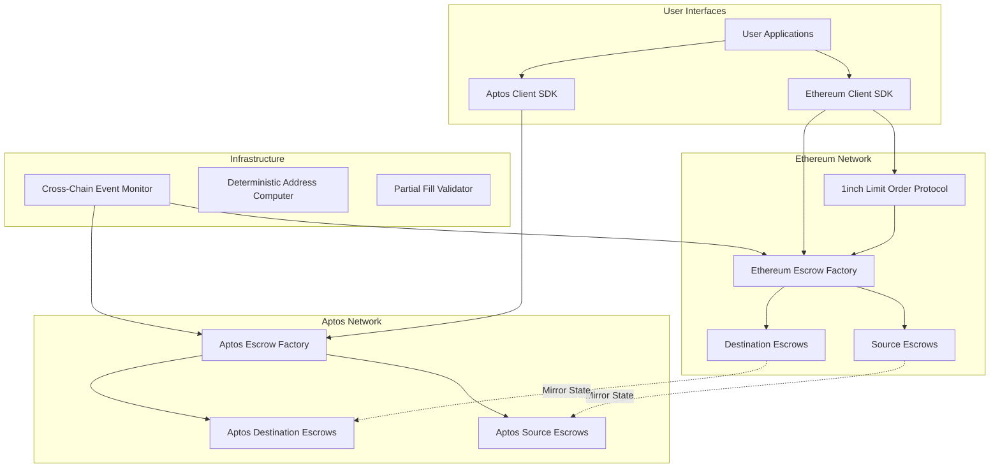
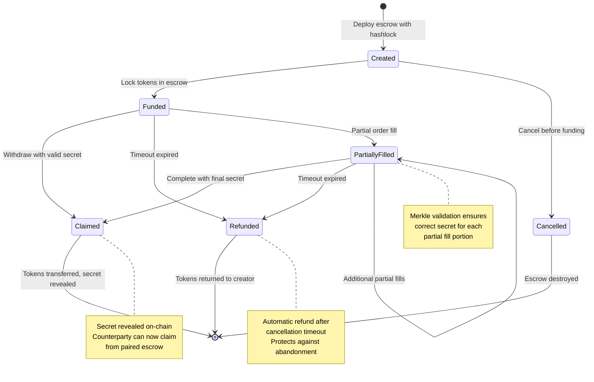

## Fusion Aptos (POC)

Cross-chain token swaps between EVM chains and Aptos using 1inch Limit Order Protocol with enterprise escrow infrastructure.

## Architecture Overview

## Escrow State Machine

## User Story

Alice holds 1 ETH and wants 3000 APT. Bob holds 5000 APT and wants ETH at current rates.

**Step 1: Alice creates intent**
Alice uses the Ethereum client to create a 1inch limit order: "I'll give 1 ETH for 3000 APT". The order includes postInteraction parameters that will automatically create an escrow when filled.

**Step 2: Bob sees opportunity**
Bob monitors cross-chain swap events and sees Alice's order. He likes the rate and decides to provide the 3000 APT. Bob generates a secret, computes its hash, and creates a destination escrow on Aptos locking his 3000 APT with the hashlock.

**Step 3: Order execution**
A taker on Ethereum fills Alice's limit order normally through 1inch. The postInteraction automatically creates a source escrow on Ethereum, locking the 1 ETH Alice received with the same hashlock Bob used.

**Step 4: Cross-chain completion**
Alice sees the destination escrow is ready and uses Bob's secret to claim her 3000 APT on Aptos. This reveals the secret on-chain. Bob monitors the Aptos chain, sees the secret revelation, and uses it to claim Alice's 1 ETH from the Ethereum escrow.

**Result**: Alice has her 3000 APT, Bob has his 1 ETH, and the swap completed atomically without either party risking their funds.

[Add more stuff blah blah blah blah]
